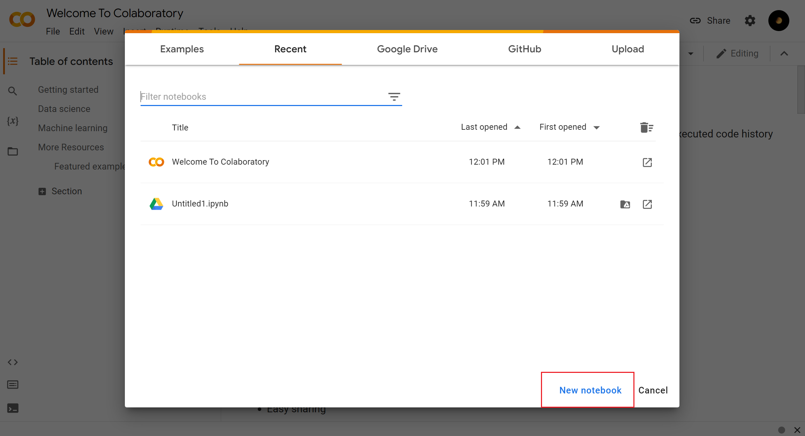
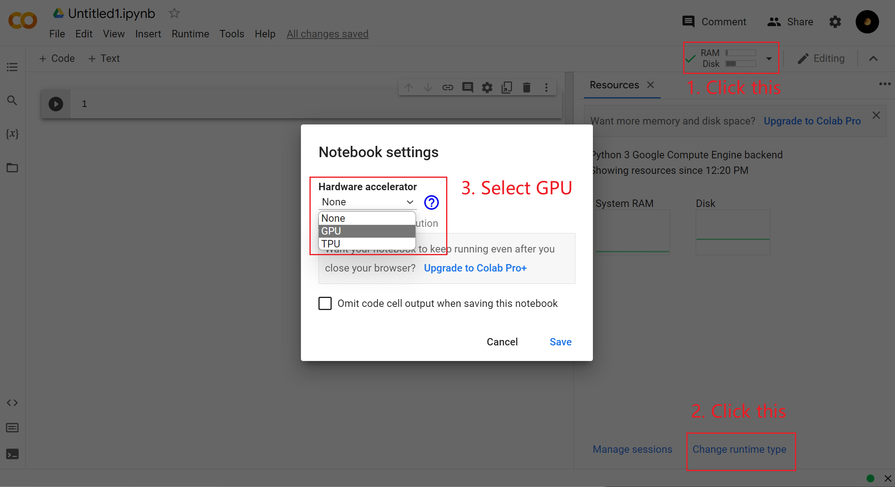
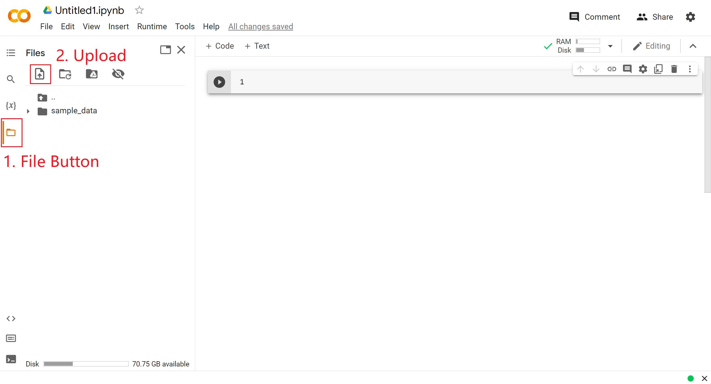
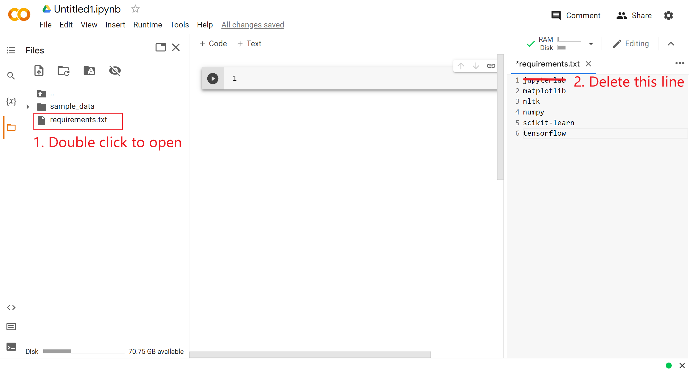
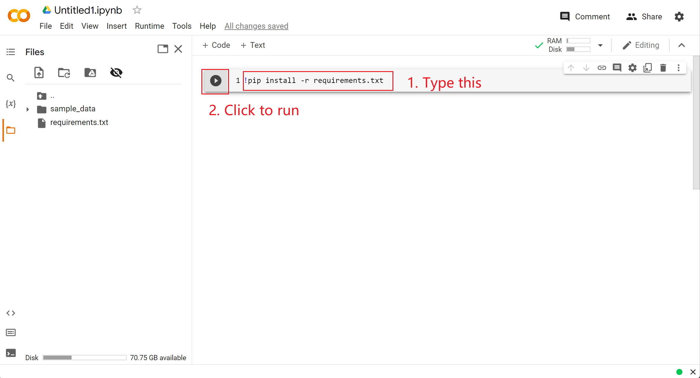
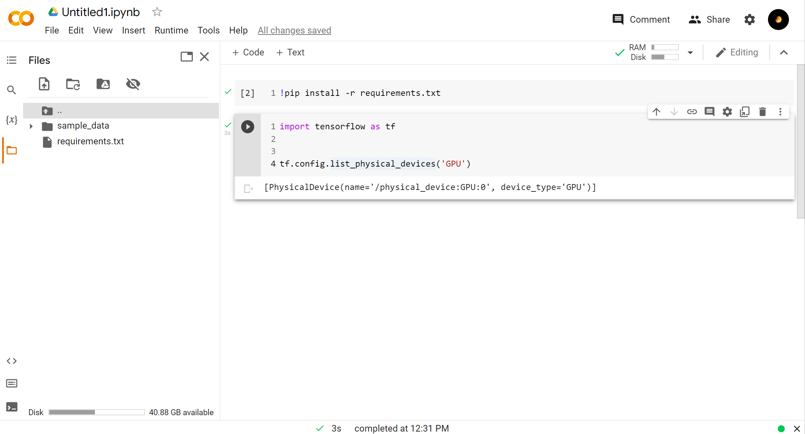
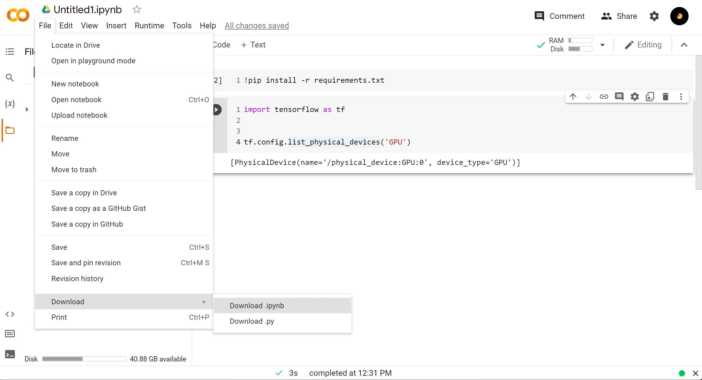

# How to Use Google CoLab

Website: [https://colab.research.google.com/](https://colab.research.google.com/)

## 1. Create a new notebook

After creation, it will automatically stored in your `Google Drive/Colab Notebooks`.

## 2. Using GPU on CoLab

## 3. Install Required Packages

### 3.1 Upload the requirements.txt into CoLab

After uploading the requirements.txt, you will need to remove jupyterlab in it, since you are using CoLab.

In the code area, type `!pip install -r requirements.txt` in the first cell and run.

### 3.4 Check whether Tensorflow can use GPU

### 4. Upload data

It is the same as uploading requirements.txt.

### 5. Download Notebook

After finishing, please remember to download your notebook with outputs. Feel free to clear the outputs of installing packages.

## 5. Note

- CoLab free user will be disconnected after 12 hours or several minitues if you do not have operations. After that, your uploaded data and variable will disappear. If your model has a longer running time than 12 hours, make sure you know how to use checkpoints.